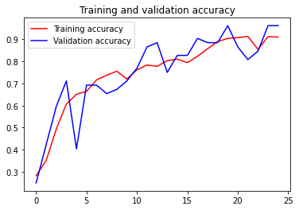
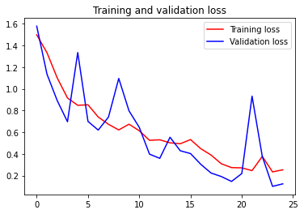

# Grapes - KrsikX

### Tensorflow model


```python
import os
import numpy as np
```


```python
grape_blackrot = os.path.join(r'D:\hrutik\B.Tech\KrsikX\Grapes\Train\Grape___Black_rot')
grape_esca = os.path.join(r'D:\hrutik\B.Tech\KrsikX\Grapes\Train\Grape___Esca_(Black_Measles)')
grape_healthy = os.path.join(r'D:\hrutik\B.Tech\KrsikX\Grapes\Train\Grape___healthy')
grape_blight = os.path.join(r'D:\hrutik\B.Tech\KrsikX\Grapes\Train\Grape___Leaf_blight_(Isariopsis_Leaf_Spot)')


validation_grape_blackrot = os.path.join(r'D:\hrutik\B.Tech\KrsikX\Grapes\Test\Grape___Black_rot') 
validation_grape_esca = os.path.join(r'D:\hrutik\B.Tech\KrsikX\Grapes\Test\Grape___Esca_(Black_Measles)')
validation_grape_healthy = os.path.join(r'D:\hrutik\B.Tech\KrsikX\Grapes\Test\Grape___healthy')
validation_grape_blight = os.path.join(r'D:\hrutik\B.Tech\KrsikX\Grapes\Test\Grape___Leaf_blight_(Isariopsis_Leaf_Spot)')
```


```python
print('total traning grape blackrot images : ', len(os.listdir(grape_blackrot)))
print('total traning grape esca images : ', len(os.listdir(grape_esca)))
print('total traning grape healthy images : ', len(os.listdir(grape_healthy)))
print('total traning grape blight images : ', len(os.listdir(grape_blight)))


print('total validation grape blackrot images : ', len(os.listdir(validation_grape_blackrot)))
print('total validation grape esca images : ', len(os.listdir(validation_grape_esca)))
print('total validation grape healthy images : ', len(os.listdir(validation_grape_healthy)))
print('total validation grape blight images : ', len(os.listdir(validation_grape_blight)))
```

    total traning grape blackrot images :  1180
    total traning grape esca images :  1383
    total traning grape healthy images :  1000
    total traning grape blight images :  1076
    total validation grape blackrot images :  13
    total validation grape esca images :  13
    total validation grape healthy images :  13
    total validation grape blight images :  13
    


```python
grape_blackrot_files = os.listdir(grape_blackrot)
print(grape_blackrot_files[:10])

grape_esca_files = os.listdir(grape_esca)
print(grape_esca_files[:10])

grape_healthy_files = os.listdir(grape_healthy)
print(grape_healthy_files[:10])

grape_blight_files = os.listdir(grape_blight)
print(grape_blight_files[:10])
```

    ['image (1).JPG', 'image (10).JPG', 'image (100).JPG', 'image (1000).JPG', 'image (1001).JPG', 'image (1002).JPG', 'image (1003).JPG', 'image (1004).JPG', 'image (1005).JPG', 'image (1006).JPG']
    ['image (1).JPG', 'image (10).JPG', 'image (100).JPG', 'image (1000).JPG', 'image (1001).JPG', 'image (1002).JPG', 'image (1003).JPG', 'image (1004).JPG', 'image (1005).JPG', 'image (1006).JPG']
    ['image (1).JPG', 'image (10).JPG', 'image (100).JPG', 'image (1000).JPG', 'image (101).JPG', 'image (102).JPG', 'image (103).JPG', 'image (104).JPG', 'image (105).JPG', 'image (106).JPG']
    ['image (1).JPG', 'image (10).JPG', 'image (100).JPG', 'image (1000).JPG', 'image (1001).JPG', 'image (1002).JPG', 'image (1003).JPG', 'image (1004).JPG', 'image (1005).JPG', 'image (1006).JPG']
    


```python
import tensorflow as tf
```


```python
model  = tf.keras.models.Sequential([
    tf.keras.layers.Conv2D(64, (3, 3), activation='relu', input_shape=(224,224, 3)),
    tf.keras.layers.MaxPooling2D(2, 2),
    
    tf.keras.layers.Conv2D(64, (3, 3), activation='relu'),
    tf.keras.layers.MaxPooling2D(2, 2),
    
    tf.keras.layers.Conv2D(128, (3, 3), activation='relu'),
    tf.keras.layers.MaxPooling2D(2, 2),
    
    tf.keras.layers.Conv2D(128, (3, 3), activation='relu'),
    tf.keras.layers.MaxPooling2D(2, 2),
    
    tf.keras.layers.Flatten(),
    #tf.keras.layers.Dropout(0.5),
    tf.keras.layers.Dense(512, activation='relu'),
    tf.keras.layers.Dense(4, activation='softmax')
])
```


```python
model.summary()
```

    Model: "sequential"
    _________________________________________________________________
    Layer (type)                 Output Shape              Param #   
    =================================================================
    conv2d (Conv2D)              (None, 222, 222, 64)      1792      
    _________________________________________________________________
    max_pooling2d (MaxPooling2D) (None, 111, 111, 64)      0         
    _________________________________________________________________
    conv2d_1 (Conv2D)            (None, 109, 109, 64)      36928     
    _________________________________________________________________
    max_pooling2d_1 (MaxPooling2 (None, 54, 54, 64)        0         
    _________________________________________________________________
    conv2d_2 (Conv2D)            (None, 52, 52, 128)       73856     
    _________________________________________________________________
    max_pooling2d_2 (MaxPooling2 (None, 26, 26, 128)       0         
    _________________________________________________________________
    conv2d_3 (Conv2D)            (None, 24, 24, 128)       147584    
    _________________________________________________________________
    max_pooling2d_3 (MaxPooling2 (None, 12, 12, 128)       0         
    _________________________________________________________________
    flatten (Flatten)            (None, 18432)             0         
    _________________________________________________________________
    dense (Dense)                (None, 512)               9437696   
    _________________________________________________________________
    dense_1 (Dense)              (None, 4)                 2052      
    =================================================================
    Total params: 9,699,908
    Trainable params: 9,699,908
    Non-trainable params: 0
    _________________________________________________________________
    


```python
from tensorflow.keras.optimizers import RMSprop

model.compile(optimizer = 'adam',
        loss = 'categorical_crossentropy',
        metrics = ['accuracy'])
```


```python
from keras_preprocessing import image
from tensorflow.keras.preprocessing.image import ImageDataGenerator

train_dir = r'D:\hrutik\B.Tech\KrsikX\Grapes\Train'

validation_dir = r'D:\hrutik\B.Tech\KrsikX\Grapes\Test'

train_datagen = ImageDataGenerator(rescale=1./255.,
                                    rotation_range=40,
                                    width_shift_range=0.2,
                                    height_shift_range=0.2,
                                    shear_range=0.2,
                                    zoom_range=0.2
                                    )

validation_datagen = ImageDataGenerator(rescale=1.0/255.)

batch_sz = 64

train_generator = train_datagen.flow_from_directory(train_dir, 
                                                    batch_size=batch_sz,
                                                    class_mode='categorical',
                                                    target_size = (224, 224))
                                
validation_generator = validation_datagen.flow_from_directory(validation_dir, 
                                                            batch_size=batch_sz,
                                                            class_mode='categorical',
                                                            target_size= (224, 224))
```

    Found 4639 images belonging to 4 classes.
    Found 52 images belonging to 4 classes.
    


```python
history = model.fit(train_generator,
                    validation_data = validation_generator,
                    steps_per_epoch = 12,
                    epochs = 25,
                    validation_steps = 1,
                    verbose = 1)
```

    Epoch 1/25
    12/12 [==============================] - 68s 5s/step - loss: 1.4983 - accuracy: 0.2826 - val_loss: 1.5785 - val_accuracy: 0.2500
    Epoch 2/25
    12/12 [==============================] - 53s 4s/step - loss: 1.3336 - accuracy: 0.3516 - val_loss: 1.1356 - val_accuracy: 0.4231
    Epoch 3/25
    12/12 [==============================] - 48s 4s/step - loss: 1.1005 - accuracy: 0.4939 - val_loss: 0.8915 - val_accuracy: 0.5962
    Epoch 4/25
    12/12 [==============================] - 48s 4s/step - loss: 0.9157 - accuracy: 0.6068 - val_loss: 0.6963 - val_accuracy: 0.7115
    Epoch 5/25
    12/12 [==============================] - 51s 4s/step - loss: 0.8479 - accuracy: 0.6510 - val_loss: 1.3347 - val_accuracy: 0.4038
    Epoch 6/25
    12/12 [==============================] - 53s 4s/step - loss: 0.8524 - accuracy: 0.6641 - val_loss: 0.6992 - val_accuracy: 0.6923
    Epoch 7/25
    12/12 [==============================] - 51s 4s/step - loss: 0.7399 - accuracy: 0.7161 - val_loss: 0.6192 - val_accuracy: 0.6923
    Epoch 8/25
    12/12 [==============================] - 51s 4s/step - loss: 0.6725 - accuracy: 0.7374 - val_loss: 0.7398 - val_accuracy: 0.6538
    Epoch 9/25
    12/12 [==============================] - 51s 4s/step - loss: 0.6206 - accuracy: 0.7552 - val_loss: 1.0961 - val_accuracy: 0.6731
    Epoch 10/25
    12/12 [==============================] - 49s 4s/step - loss: 0.6737 - accuracy: 0.7201 - val_loss: 0.7969 - val_accuracy: 0.7115
    Epoch 11/25
    12/12 [==============================] - 50s 4s/step - loss: 0.6130 - accuracy: 0.7617 - val_loss: 0.6447 - val_accuracy: 0.7692
    Epoch 12/25
    12/12 [==============================] - 47s 4s/step - loss: 0.5249 - accuracy: 0.7837 - val_loss: 0.3973 - val_accuracy: 0.8654
    Epoch 13/25
    12/12 [==============================] - 50s 4s/step - loss: 0.5295 - accuracy: 0.7773 - val_loss: 0.3583 - val_accuracy: 0.8846
    Epoch 14/25
    12/12 [==============================] - 49s 4s/step - loss: 0.5016 - accuracy: 0.8034 - val_loss: 0.5531 - val_accuracy: 0.7500
    Epoch 15/25
    12/12 [==============================] - 49s 4s/step - loss: 0.4929 - accuracy: 0.8099 - val_loss: 0.4284 - val_accuracy: 0.8269
    Epoch 16/25
    12/12 [==============================] - 51s 4s/step - loss: 0.5317 - accuracy: 0.7943 - val_loss: 0.4024 - val_accuracy: 0.8269
    Epoch 17/25
    12/12 [==============================] - 50s 4s/step - loss: 0.4475 - accuracy: 0.8229 - val_loss: 0.3034 - val_accuracy: 0.9038
    Epoch 18/25
    12/12 [==============================] - 49s 4s/step - loss: 0.3890 - accuracy: 0.8568 - val_loss: 0.2230 - val_accuracy: 0.8846
    Epoch 19/25
    12/12 [==============================] - 51s 4s/step - loss: 0.3087 - accuracy: 0.8893 - val_loss: 0.1906 - val_accuracy: 0.8846
    Epoch 20/25
    12/12 [==============================] - 52s 4s/step - loss: 0.2728 - accuracy: 0.9036 - val_loss: 0.1451 - val_accuracy: 0.9615
    Epoch 21/25
    12/12 [==============================] - 65s 5s/step - loss: 0.2707 - accuracy: 0.9076 - val_loss: 0.2179 - val_accuracy: 0.8654
    Epoch 22/25
    12/12 [==============================] - 63s 5s/step - loss: 0.2450 - accuracy: 0.9128 - val_loss: 0.9323 - val_accuracy: 0.8077
    Epoch 23/25
    12/12 [==============================] - 60s 5s/step - loss: 0.3761 - accuracy: 0.8542 - val_loss: 0.3756 - val_accuracy: 0.8462
    Epoch 24/25
    12/12 [==============================] - 60s 5s/step - loss: 0.2335 - accuracy: 0.9115 - val_loss: 0.0997 - val_accuracy: 0.9615
    Epoch 25/25
    12/12 [==============================] - 61s 5s/step - loss: 0.2524 - accuracy: 0.9102 - val_loss: 0.1231 - val_accuracy: 0.9615
    


```python
import matplotlib.pyplot as plt
acc = history.history['accuracy']
val_acc = history.history['val_accuracy']
loss = history.history['loss']
val_loss = history.history['val_loss']

epochs = range(len(acc))

plt.plot(epochs, acc, 'r', label='Training accuracy')
plt.plot(epochs, val_acc, 'b', label='Validation accuracy')
plt.title('Training and validation accuracy')
plt.legend(loc=0)
plt.figure()


plt.show()
```


    

    


    <Figure size 432x288 with 0 Axes>


```python
epochs = range(len(acc))

plt.plot(epochs, loss, 'r', label='Training loss')
plt.plot(epochs, val_loss, 'b', label='Validation loss')
plt.title('Training and validation loss')
plt.legend(loc=0)
plt.figure()
```


    <Figure size 432x288 with 0 Axes>


    

    


    <Figure size 432x288 with 0 Axes>


### mode.save


```python
if os.path.isfile('D:\hrutik\B.Tech\KrsikX\Grapes\models\grape_model.h5') is False:
    model.save('D:\hrutik\B.Tech\KrsikX\Grapes\models\grape_model.h5')
```

### to test model with new images


```python
from keras.models import load_model

IMG_SIZE = 224
file_path = 'D:\hrutik\B.Tech\KrsikX\Grapes\Train\Grape___healthy\image (17).jpg'
test_image = image.load_img(file_path, target_size=(IMG_SIZE,IMG_SIZE))
 
test_image = image.img_to_array(test_image)
test_image = np.expand_dims(test_image, axis=0)
model = load_model('D:\hrutik\B.Tech\KrsikX\Grapes\models\grape_model.h5')

result = model.predict(test_image)
index = np.argmax(result)
print(index)
```

    3
    


```python

```
